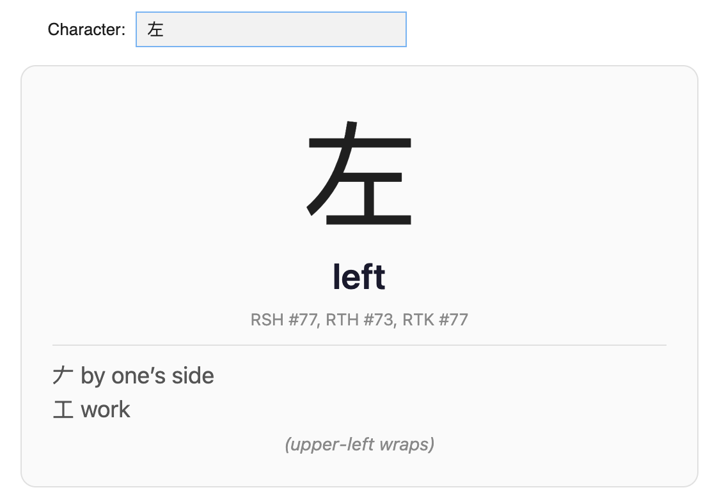
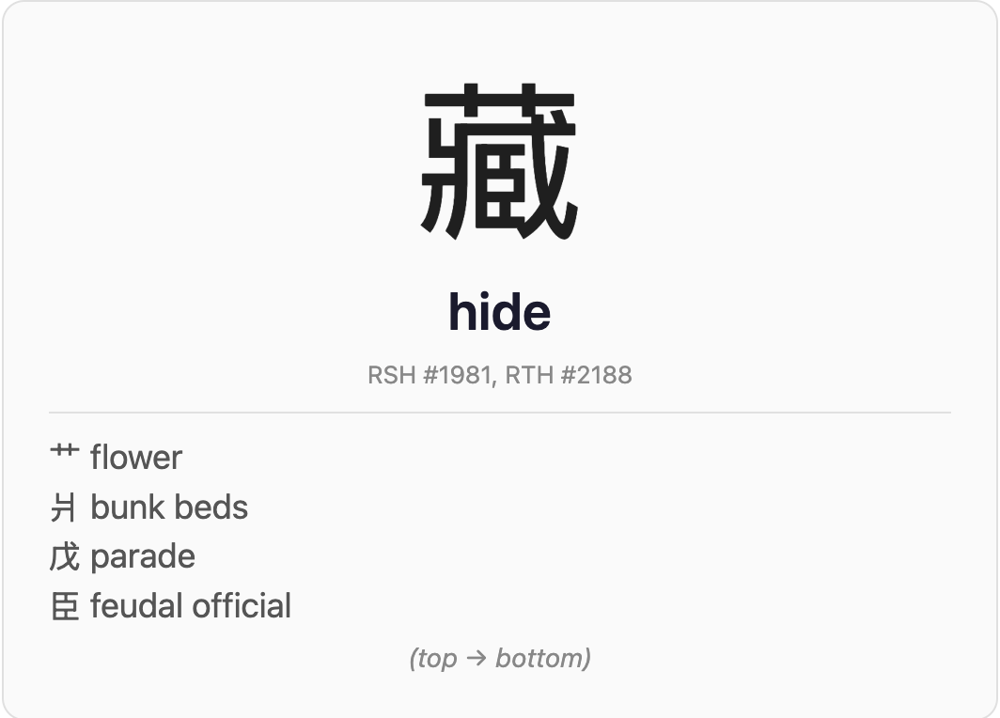

# Heisig Anki Decks & Character Decomposition

> **Work in progress** — This project is under active development. Simplified Chinese characters currently have the best decomposition quality; Traditional Chinese and Japanese may have less meaningful breakdowns.

Tools for learning Chinese and Japanese characters using James W. Heisig's method: an **Anki add-on** that breaks down characters into components with spatial layout info, plus **pre-built decks** if you just want the flashcards.

[](https://colab.research.google.com/github/ebriggsjohnson/heisig_anki_plugin/blob/main/demo.ipynb)

---

## Anki Add-on

The add-on decomposes any character into its meaningful components. It works with any deck — you don't need to be studying Heisig specifically.

### Features

- **One-click decomposition**: click the <span style="color:#2196F3">**字**</span> button in the editor to break down the current character
- **Human-readable layout**: shows spatial arrangement (e.g. "left → right", "top → bottom", "upper-left wraps")
- **Respects your keywords**: if you've already defined a keyword for a component character in your deck, the plugin uses yours instead of the Heisig default
- **Auto-fill mode**: optionally triggers decomposition automatically when you tab out of the Character field
- **Configurable**: Tools → Heisig Settings to set field names

### Screenshots

| 左 (left) | 藏 (hide) |
|-----------|-----------|
|  |  |

### Install

```bash
# Option 1: Symlink for development
ln -s /path/to/heisig_addon ~/Library/Application\ Support/Anki2/addons21/heisig_addon

# Option 2: Package and install via Anki
cd heisig_addon && zip -r ../heisig_addon.ankiaddon *
# Then: Anki → Tools → Add-ons → Install from file → select heisig_addon.ankiaddon
```

Restart Anki after installing.

### Usage

1. Your note type needs a **Character** field and a **Heisig Explanation** field (field names are configurable in Tools → Heisig Settings)
2. Type a character in the Character field
3. Click the **字** button in the editor toolbar
4. The Heisig Explanation field fills with:
   - Keyword
   - Components with their meanings (one per line)
   - Spatial layout description

---

## Pre-built Decks

If you don't want to install an add-on, you can just download and import the pre-built `.apkg` decks. These include all the decomposition data baked into each card.

| File | Contents | Cards |
|------|----------|-------|
| `RSH_deck.apkg` | Simplified Chinese (Heisig + SC::L1/L2) | 8,116 |
| `RTH_deck.apkg` | Traditional Chinese (Heisig + TC::A/B) | 6,745 |
| `RTK_deck.apkg` | Japanese Kanji (Heisig only) | 3,299 |
| `Ultimate_deck.apkg` | All combined | 12,628 |

### Extended Character Sets

Beyond the original Heisig characters, the decks include additional standard characters:

**Simplified (in RSH + Ultimate):**
- `SC::L1` — Frequently used (~3,500)
- `SC::L2` — Commonly used (~1,300)

**Traditional (in RTH + Ultimate):**
- `TC::A` — Common traditional (~4,800)
- `TC::B` — Secondary traditional (~6,300)

Additional rare simplified characters (SC::L3 — names/terminology) are saved separately in `data/simplified_additions.csv`.

Each card includes: character, keyword, book numbers (where applicable), pinyin readings, recursive component decomposition, spatial layout (IDS), and tags.

**Note:** The component decompositions are algorithmically generated and may not match Heisig's books exactly. Keywords for non-Heisig characters are auto-generated from CC-CEDICT and Unihan databases — these have not been manually verified for accuracy or usefulness as mnemonics.

To import: open Anki → File → Import → select the `.apkg` file.

### Non-Unicode Primitives

57 Heisig primitives have no standard Unicode representation (marked with `囧` in the source XML). These are rendered as approximate images using visually similar characters. See `data/primitive_images/manifest.json` for the full mapping.

---

## Try It Online

[](https://colab.research.google.com/github/ebriggsjohnson/heisig_anki_plugin/blob/main/demo.ipynb)

Click the badge to open an interactive demo in Google Colab — no install required. Type any character and see its decomposition instantly.

---

## Future Features

- **AI-generated mnemonic stories**: Use an LLM to generate vivid stories connecting component meanings to keywords
- **Improved Traditional/Japanese decomposition**: Better primitive mappings for RTH and RTK
- **Verify auto-generated keywords**: Review SC/TC character keywords for accuracy and mnemonic usefulness

---

## Building from Source

### Setup

```bash
git clone --recurse-submodules https://github.com/ebriggsjohnson/heisig_anki_plugin.git
pip install openpyxl genanki Pillow
```

The Excel workbook (`data/Heisig's Remembering the Kanji vs. Hanzi v27.xlsx`) is required for `build_decks.py` but not included in the repo. Place it in `data/` manually.

### Scripts

| Script | Purpose |
|--------|---------|
| `scripts/parse_rsh.py` | Parse `rsh.xml` → `rsh_parsed.json` |
| `scripts/build_mapping.py` | Build component-to-name mappings |
| `scripts/build_decks.py` | Generate CSV decks |
| `scripts/crop_primitives.py` | Generate primitive approximation images |
| `scripts/build_apkg.py` | Package CSVs + images into `.apkg` files |
| `scripts/build_addon_data.py` | Build `heisig_data.json` for the add-on and web demo |

### Rebuilding decks

```bash
python scripts/crop_primitives.py   # generate primitive images
python scripts/build_apkg.py        # build .apkg with embedded media
```

## Data Sources

- **Heisig XML database**: [rouseabout/heisig](https://github.com/rouseabout/heisig) by Peter Ross (MIT license) — included as a submodule in `data/heisig-repo/`
- **IDS decomposition data**: `data/IDS.TXT` from the [CHISE project](https://www.chise.org/)
- **CC-CEDICT**: Chinese-English dictionary for keywords and readings
- **Unihan database**: Unicode Han character definitions for rare characters
- **通用规范汉字表**: PRC standard character list (8,105 characters)
- **常用國字標準字體表**: Taiwan standard character lists

## License

Scripts in this repo are provided as-is. The Heisig XML data (`data/heisig-repo/`) is MIT-licensed by Peter Ross. _Remebering Traditional Hanzi_, _Remembering Simplified Hanzi_, and _Remembering the Kanji _ are the intellectual property of James W. Heisig.
